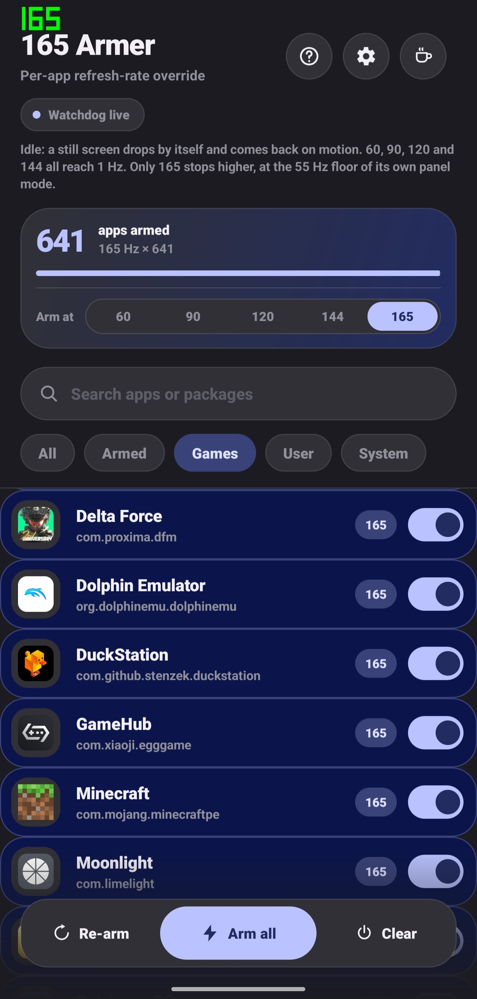

# 165 Armer (`armer-app/`)

Rootless per-app refresh-rate unlock (60 / 90 / 120 / 144 / 165 Hz) for the
OnePlus 15 (CPH2747/CPH2749, OxygenOS 16). No root, no Magisk, no bootloader
unlock.

<p align="center">
  
</p>

## Features

- Per-app rate pinning with a searchable app list (All / Armed / Games /
  User / System filters) and arm-at-rate selector
- **Arm all / Re-arm / Clear** sweeps; armed set persists across reboots
- **Watchdog service** re-issues the vote while the screen is on, beating
  games that pin their own frame rate — foreground-last, so a big armed set
  cannot dissolve the pin it just set (see below)
- **FPS overlay** in the status bar: real panel Hz plus a foreground game's
  rendered fps (needs "Display over other apps")
- Follows the system theme and wallpaper (Material You), edge to edge

## How it works

Calls the unguarded vendor IPC (no permission check):

```
service:  "oplusscreenmode"
iface:    com.oplus.screenmode.IOplusScreenMode
transact: 0x0c   requestGameRefreshRate(String packageName, int rateId)
```

Rate ids from `refresh_rate_config.xml`: `1`=90, `2`=60, `3`=120, `4`=144,
`7`=165 — note the ids are not in Hz order, 90 comes before 60. The vote
applies while the app is foregrounded, and the call is a plain set: handing
the vendor an id it already holds re-writes the same pin, it does not
withdraw it. Disarming asks for rate id `0` — the server-side verified
cancel (see below).

### Verified against the server (CPH2749_16.0.9.400)

Decompiled `oplus-services.jar` (md5 `4ee84ffc…`, byte-identical to the
build this was written on) and live `service call` probes from an
unprivileged uid:

- `requestGameRefreshRate(pkg, 0)` is the vendor's own cancel: the server
  takes the `mOifaceRequestedRates.remove(pkg)` branch and then rewrites the
  override on every live window the package owns. Returns 1, idempotent,
  no reboot needed. This is the only mutating call a rootless app can make.
- `setAppOverrideRefreshRate` (0x19), `removeCustomizeRefreshRate` (0x1c),
  `removeAllCustomizeRefreshRate` (0x1d), `getAppOverrideRefreshRate` (0x1a)
  and `getVoteInfo` all enforce `oplus.permission.OPLUS_COMPONENT_SAFE` —
  a live call answers with a `SecurityException` naming it. The
  "Settings uses setAppOverrideRefreshRate" route is closed to us.
- `oplus_vrr_service` (`com.oplus.vrr.IOPlusRefreshRate`) has zero caller
  checks (verified: 0 `enforceCalling` in 12,754 smali lines), and its FRTC
  path (`setFrameRateTargetControl`, tx 0x14) reaches SurfaceFlinger as
  transaction `0x5601` — a per-process frame-rate ceiling that leaves the
  LTPO floor free. Candidate for a future ceiling-only arm; not needed for
  the idle ramp below.

## Build & install

```bash
proot-distro login ubuntu -- bash -lc '
  export ANDROID_HOME=/root/android-sdk
  cd /data/data/com.termux/files/home/Force165hz-Oneplus-15-NoRoot/armer-app
  ./gradlew assembleDebug --offline'
cp app/build/outputs/apk/debug/app-debug.apk ~/storage/downloads/arm165-debug.apk
```

Output: `app/build/outputs/apk/debug/app-debug.apk` (debug-signed, package
`tf.arm165`). Tap to install from Downloads; grant the notification
permission on first launch.

## Notes

- The armed app must be foregrounded to receive the vote.
- Video apps may judder — disarm them or pin at 60 Hz.
- Battery and heat increase with the number of armed apps. The panel's LTPO
  floor depends on the mode the vote selects — measured on this build:
  60→30 Hz, 90→30 Hz, 120→1 Hz, 165→55 Hz (144 not measured yet; the code
  estimates 48) — so a held 165 vote can never idle below 55 on its own. The
  watchdog parks it instead: after a couple of quiet ticks it swaps the vote
  for 120, the one rate whose mode spans 1–120, so a still screen ramps to
  1 Hz while the vote itself stays held (game-engine self-pins still lose to
  ours). One rule decides what may park — a vote whose ceiling is **above**
  120, i.e. 144 and 165. A 120 vote already is the park, and 60/90 are
  ceilings chosen to keep faster content off the panel, so the park never
  raises them. Rate starvation (panel pinned near the 120 ceiling), a
  `GPU_ACTIVE` load or ≥45 measured fps puts the armed rate back in ~55 ms;
  a park that content undoes within 3 s was the 120 mode's own entry churn,
  so that package is left unparked for 30 s instead of oscillating.
- **Why votes are issued foreground-last.** The server writes the override
  onto the live windows of the package each call names, and the panel takes
  its mode from the write that landed last. A pass that ends on a background
  package hands the display a vote for windows that do not exist — which is
  what "Arm all" used to do every second, in package order: the foreground
  app's pin was dissolved by whatever sorted after it and the panel fell back
  to its default 1–120 range, idling to 1 Hz inside an app that was supposed
  to be pinned. Background votes are sticky in the vendor's map (only a
  release takes one away), so they are refreshed a bounded slice at a time
  and the app on screen — as oiface reports it — always owns the last write.
- `android` and `com.android.systemui` are never armed. The framework is the
  package `setrate.sh --all` has always skipped, and SystemUI's windows are
  composited alongside every app's, so a vote on either is a vote on the
  whole display rather than on one app. An armed set from an older build has
  them dropped and released on first launch.
- A `SecurityException` after an OTA means the vendor patched the trick.
- If an app stays pinned after a disarm, the vote withdraw was refused on
  that build — `adb logcat -s Arm165` logs it; a reboot always clears the
  vendor's state.

**Use at your own risk.** Undocumented vendor IPC; battery/thermal
disclaimers apply.
