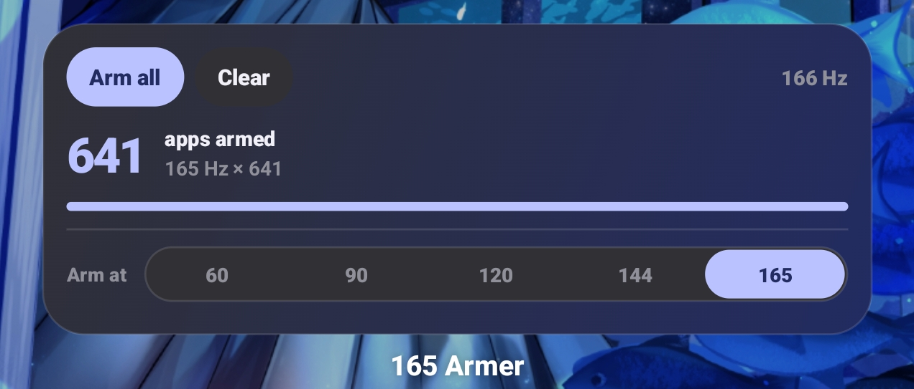

# 165 Armer (`armer-app/`)

### [Download the latest APK](https://github.com/tryptz/Force165hz-Oneplus-15-NoRoot/releases/latest/download/arm165.apk)

[Release notes and older builds](https://github.com/tryptz/Force165hz-Oneplus-15-NoRoot/releases/latest)

Rootless per-app refresh-rate unlock (60 / 90 / 120 / 144 / 165 Hz) for the
OnePlus 15 (CPH2747/CPH2749, OxygenOS 16). No root, no Magisk, no bootloader
unlock.

  
   
  

## Features

- Per-app refresh-rate control
- Search and filters
- Arm all, re-arm, clear, and home-screen widget
- Restores armed apps after reboot
- Watchdog that keeps the selected rate active
- Smoothness test and live diagnostics

Use

1. Install the APK.
2. Select an app.
3. Choose a refresh rate.

Usage access is required only when more than eight apps are armed.

## Compatibility

Tested on the OnePlus 15 with OxygenOS 16.

The app automatically detects vendor differences between OxygenOS builds, including the OnePlus Nord 6 transaction layout.

Other models may work if they expose the same "oplusscreenmode" service.

### OnePlus Nord 6 / Turbo 6 (PLU110): stuck at 120 Hz

These phones keep 144 and 165 Hz for "selected apps"
(`persist.oplus.display.ogfr.exclusive=144,165`). If 60/90/120 work but
144/165 don't, check two things:

1. **Usage access.** With more than 8 apps armed, only the app on screen gets
   the refresh rate, and the app needs usage access to know which one that is.
   Without it, nothing gets the rate. Grant it in the app's Settings, or run
   `adb shell appops set tf.arm165 GET_USAGE_STATS allow`, or arm 8 apps or fewer.
2. **The extreme-refresh switch.** The log line `extreme=0` means OPlus's
   `app_extreme_high_refresh_switch` is off. Let the app turn it on with
   `adb shell pm grant tf.arm165 android.permission.WRITE_SECURE_SETTINGS`,
   or run `adb shell settings put global app_extreme_high_refresh_switch 1`.

## LTPO behavior

Selected rate| Idle rate
60 / 90 / 120 Hz| ≈1 Hz
144 Hz| ≈1 Hz through 120 Hz parking
165 Hz| ≈55 Hz

Notes

- High refresh rates increase battery use and heat.
- Use 60 Hz if a video app judders.
- OxygenOS updates may block the undocumented interface.
- Reboot if an app remains pinned after disarming.

The app uses OnePlus’s undocumented "IOplusScreenMode.requestGameRefreshRate" call. Transaction numbers are detected at launch because they differ between firmware builds.

See "Releases" (https://github.com/tryptz/Force165hz-Oneplus-15-NoRoot/releases) for changelogs and older builds.

**Use at your own risk.** Undocumented vendor IPC; battery and thermal
disclaimers apply.
